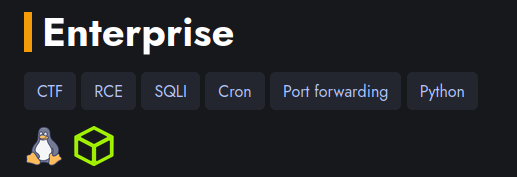
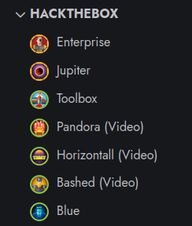

This configuration is specifically designed for websites created with Hugo. Its main function is to automatically apply icons based on the operating system of a CTF, the platform, and the corresponding difficulty. Subsequently, it facilitates the classification and sorting of these challenges according to various criteria, such as difficulty, platform, among others, enabling the creation of detailed statistics.



To incorporate a bar reflecting the difficulty, operating system icon, and platform in your posts, we will need to introduce new parameters in the blog entries, such as "os" (operating system), "difficulty," and "platform."

For example:

```
os: linux
difficulty: Hard
platform: htb
```

Then, in the single.html file, which handles the layout of the post pages, we will add the following code to integrate this information:

```html
<div style="display: flex; align-items: center;">
    {{ with .Params.dificulty -}}
        {{ if eq . "Easy" }}
            <div style="border-left: 8px solid #4CA113; height: 40px; margin-right: 10px;"></div>
        {{ else if eq . "Medium" }}
            <div style="border-left: 8px solid #F49B0A; height: 40px; margin-right: 10px;"></div>
        {{ else if eq . "Hard" }}
            <div style="border-left: 8px solid #E91414; height: 40px; margin-right: 10px;"></div>
        {{ else if eq . "Insane" }}
            <div style="border-left: 8px solid #631515; height: 40px; margin-right: 10px;"></div>
        {{ end }}
    {{ end -}}
    <h1 style="margin: 0; vertical-align: middle;">{{ .Title }}</h1>
</div>

<div style="display: flex; align-items: center; vertical-align: middle;">
    {{ with .Params.os -}}
        {{ if eq . "Linux" }}
            
        {{ else if eq . "Windows" }}
            
        {{ else }}
        {{ end }}
    {{ end -}}

    {{ with .Params.platform -}}
        {{ if eq . "htb" }}
            
        {{ else if eq . "thm" }}
            
        {{ else if eq . "hmv" }}
            
        {{ else }}
        {{ end }}
    {{ end }}
</div>

```

(Emphasizing that the configuration may vary depending on the website theme.)



If you want to add a section with statistics for all write-ups, you can include the [stats.html](stats.html) file in the path shown in the following diagram.

```
layouts/
└── shortcodes
    ├── stats.html
    └── ...
```

(Remember to change the paths of the images...)
